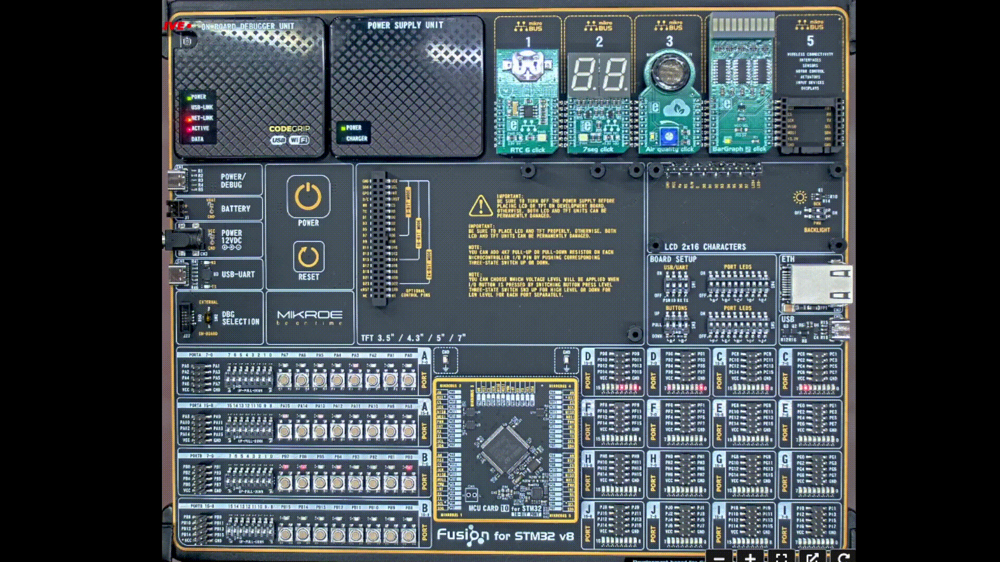
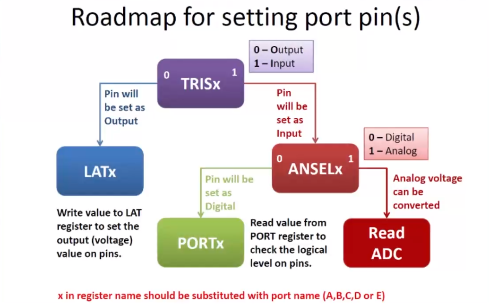
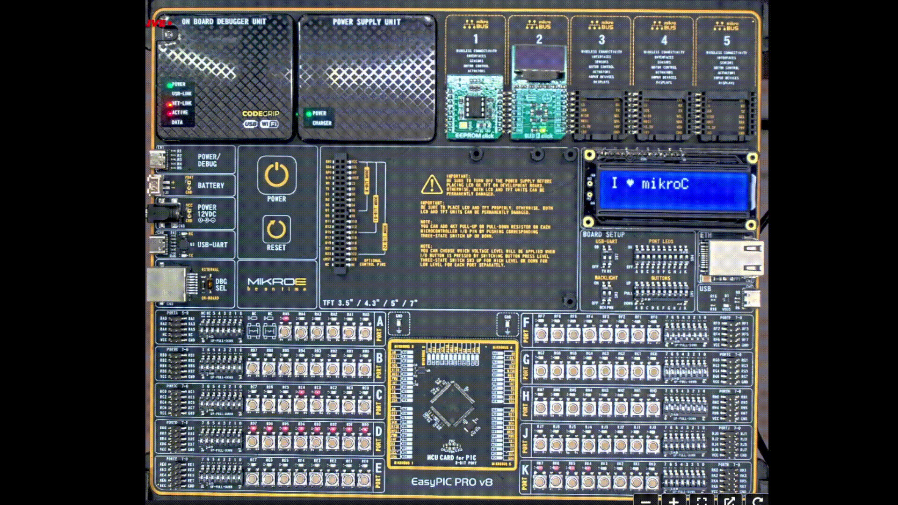
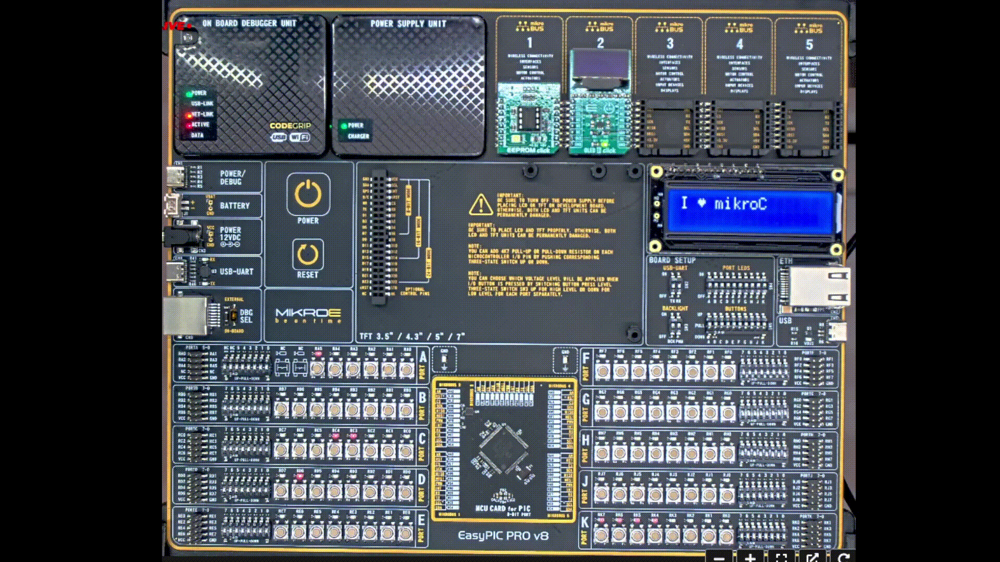

_This is an **educational training for the Mikroe company** Project_

# Week 1

## Lecture 1 - Intro

- [ ] [LED-Blinking] - (https://github.com/kroharu/Mikroe-Training/tree/master/week_1/Lecture_1/Led_Blinking)
- [ ] [LED-Curtain] - (https://github.com/kroharu/Mikroe-Training/tree/master/week_1/Lecture_1/Led_Curtain)

A Barargraph_2 example code running:

## Lecture 2 - First steps in embedded C

- [X] [Memmory allocation] - (https://github.com/kroharu/Mikroe-Training/tree/master/week_1/Lecture_2/Malloc_Learn)
- [X] [Keywords] - (https://github.com/kroharu/Mikroe-Training/tree/master/week_1/Lecture_2/Keywords)
- [X] [Statements] - (https://github.com/kroharu/Mikroe-Training/tree/master/week_1/Lecture_2/Statements)

RAM - random access memory 

ROM - read only memory 

ARM - advanced RISC machine 

RISC - reduced instruction set computer 

Keywords: 

| Data type    | Buts (Bytes) | Range                                |
|--------------|--------------|--------------------------------------|
| bit          | 1            | 0 or 1 (bit addressable part of RAM) |
| signed int   | 16 (2)       | -32768 to +32767                     |
| unsigned int | 16 (2)       | 0 to 65535                           |
| signed char  | 8 (1)        | -128 to +127                         |
| unsigned     | 8 (1)        | 0 to 255                             |
| float        | 32 (4)       | ±1.175494E - 38 to ±3.402823E + 38   |
| double       | 32 (4)       | ±1.175494E - 38 to ±3.402823E + 38   |
| sbit         | 1            | 0 or 1 (bit addressable part of RAM) |
| sfr          | 8 (1)        | RAM Addresses (80h to FFh)           |
| sfr16        | 16 (2)       | 0 to 65535                           |

Arithmetical operators precedence table: 

| Category       | Operator                         | Associativity |
|----------------|----------------------------------|---------------|
| Postfix        | <code>() [] -> . ++ --</code>    | Left to right |
| Unary          | + - ! ~ ++ -- (type)* & sizeof   | Right to left |
| Multiplicative | * / %                            | Left to right |
| Additive       | + -                              | Left to right |
| Shift          | << >>                            | Left to right |
| Relational     | < <= > >=                        | Left to right |
| Equality       | == !=                            | Left to right |
| Bitwise AND    | &                                | Left to right |
| Bitwise XOR    | ^                                | Left to right |
| Bitwise OR     | |                                | Left to right |
| Logical AND    | &&                               | Left to right |
| Logical OR     | ||                               | Left to right |
| Conditional    | ?:                               | Left to right |
| Assignment     | = += -= /= %= > >= < <= &= ^= |= | Right to left |
| Comma          | ,                                | Left to right |

## Lecture 3 - Clocks & Pins

- [X] [Clock_Test] - (https://github.com/kroharu/Mikroe-Training/tree/master/week_1/Lecture_3/Clock_Test_PIC97J94)
- [X] [LED_Test] - (https://github.com/kroharu/Mikroe-Training/tree/master/week_1/Lecture_3/LED_Test)
- [ ] [Button_Test] - (https://github.com/kroharu/Mikroe-Training/tree/master/week_1/Lecture_3/Button)

Pins roadmap:

LED_Blink Test:

My LED_Run Test:

## Lecture 4 - MCU Basis

- [ ] [UART Polling example] - (https://github.com/kroharu/Mikroe-Training/tree/master/week_1/Lecture_4/Polling_example)
- [ ] [PIC GPIO interrupt example] - (https://github.com/kroharu/Mikroe-Training/tree/master/week_1/Lecture_4/PIC_GPIO_example)
- [ ] [STM32 GPIO interrupt example] - (https://github.com/kroharu/Mikroe-Training/tree/master/week_1/Lecture_4/STM32_GPIO_interrupt_example)

| Interrupt                                             | Polling                                               |
|-------------------------------------------------------------------------------------------|--------------------------------------------------------------------------------------------------|
| Device notices the CPU that it requires its attention | CPU steadly checks whether the device needs attention |
| It's a hardware mechanism                             | It's a protocol                                       |
| Device is serviced by interrupt handler               | Device is serviced by CPU                             |
| Interrupt can take place at any time                  | CPU steadly ballots the device at regular or proper interval |
| Interrupt request line is used as indication for indicating that device requires servicing | Command ready bit is used as indicating that device requires servicing |
| Processor is simply disturbed once any device interrups it | Processor wastes countless processor cycles by repeatedly checking the command-ready bit of each device |
